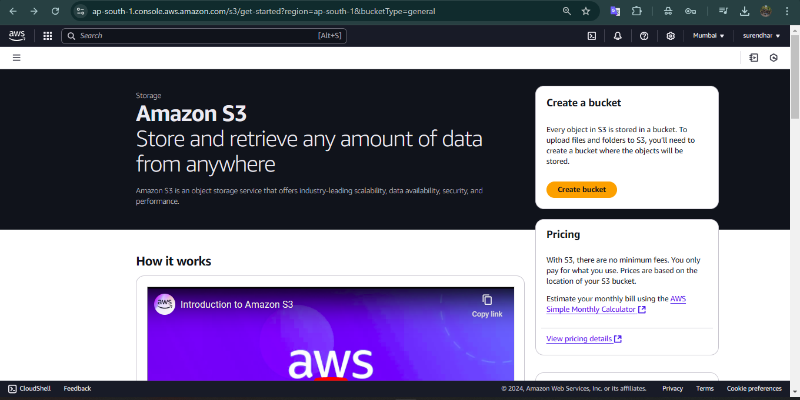
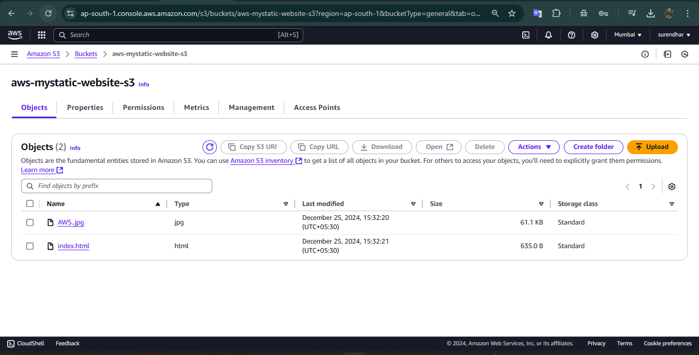
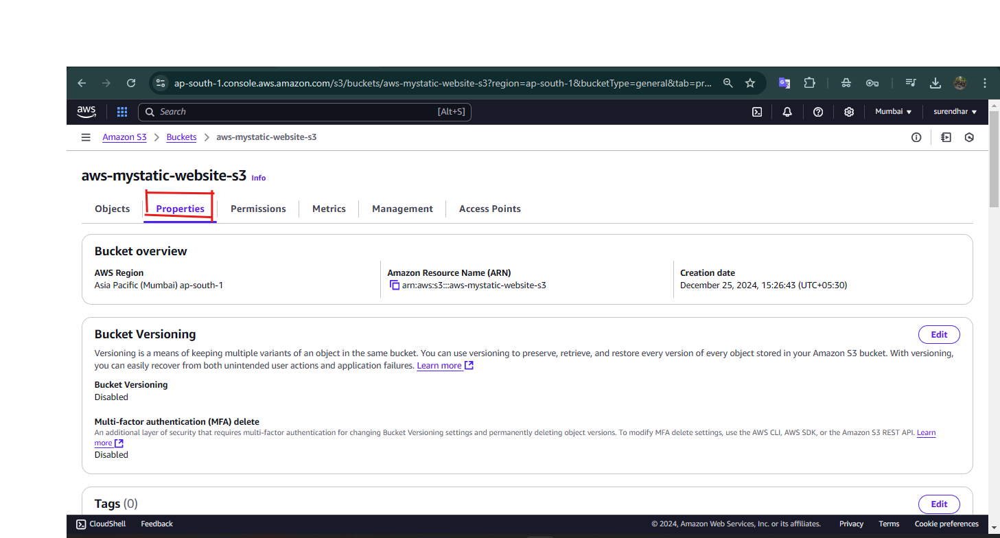
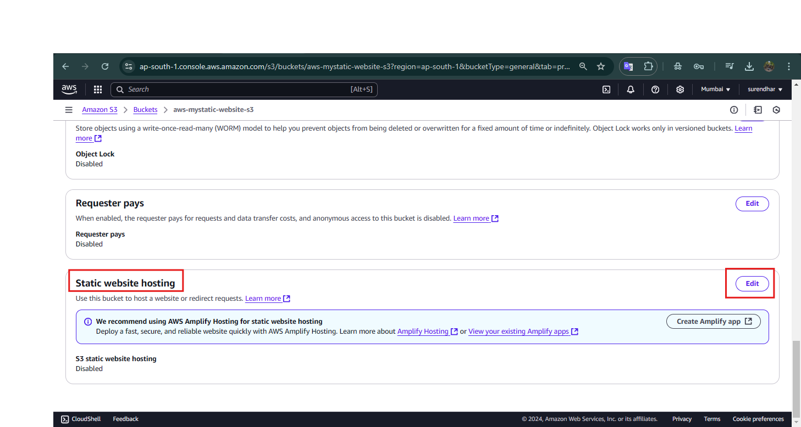
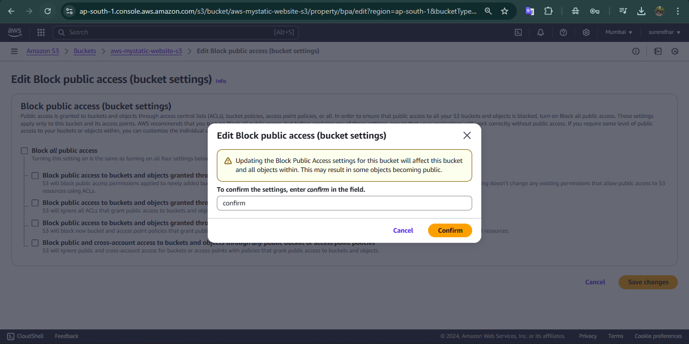
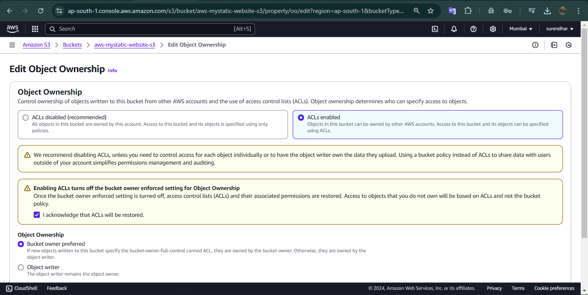
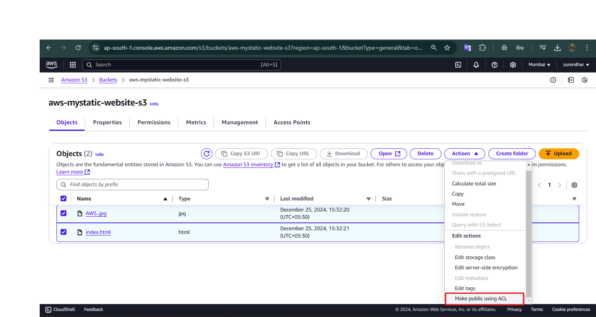
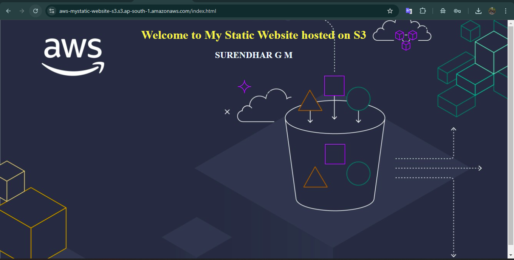

# Static website hosted on AWS S3
## Steps to Follow:
### Step 1: Set Up an S3 Bucket
1.  Log in to your AWS Management Console. 
2.  In the search bar, type S3 and select the S3 service. 
3.  Click the Create bucket button to begin the setup. 

    bucket Creation Completed Successfully:
4.  Provide a unique name for your bucket (e.g.,aws-mystatic-website-s3) and select a preferred region. 

5.  Disable the "Block all public access" option to make the website accessible publicly. 
6.  Acknowledge the warning by selecting the checkbox, then click "Create bucket" to finalize the process. 

### Step 2: Upload Your Website Files
1.  Open the newly created S3 bucket. 
2.  Navigate to the Objects tab and click on Upload. 
3.  Select all the website files you want to host (e.g., index.html,etc.). 
4.  Click Upload to add the files to your S3 bucket. 

Objects uploaded to the bucket.

### Step 3: Enable Static Website Hosting
1.  Navigate to the "Properties" tab of your S3 bucket. 

2.  Scroll down to the "Static website hosting" section and click "Edit." 

3.  Select the "Enable" option to activate static website hosting. 
4.  Enter the name of your index document (e.g., index.html), and optionally, provide an error document (e.g., error.html). 

5.  Click "Save changes" to apply the settings. 

### Step 4: Customize Public Access Settings
1.  In the "Edit Block public access (bucket settings)" screen, you will see four options:

2.  Choose the settings based on your requirements. 
3.  If you want to allow public access, uncheck the options as per your needs. 
4.  If you want to enforce strict blocking, ensure all options are checked or click the top-level "Block all public access" checkbox. 

5.  After selecting the desired settings, click the "Save changes" button at the bottom. 
6.  A confirmation dialog will appear, warning you that modifying these settings might make some objects public or private. 
7.  Enter "confirm" in the text field provided. 
8.  Click the "Confirm" button to apply your changes.

### Step 5: Enable Object Ownership
1.  In the bucket settings, click on Edit Object Ownership. 
2.  Select the option ACLs Enabled. 
3.  Click on the I acknowledge that ACLs will be restored (checkbox).

### Step 6: Make Objects Public
1.  Select the Objects tab. 
2.  Click on the Actions dropdown menu. 
3.  Select Make public. 
4.  Select the objects aws.jpg and index.html. 
5.  Click Make public.

## Result:

qwertyujklkjhfdsjkjhfdjkhfdjhdjhfdgjkhfdjfdsghfshsjhfdfjkfd